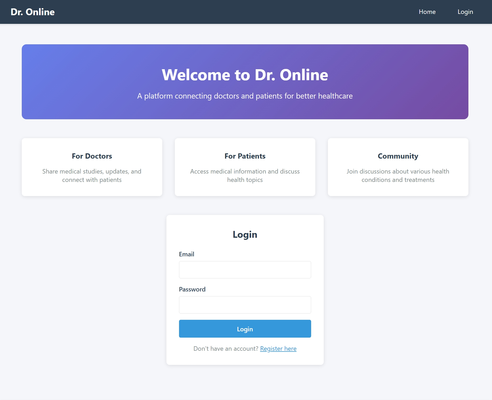
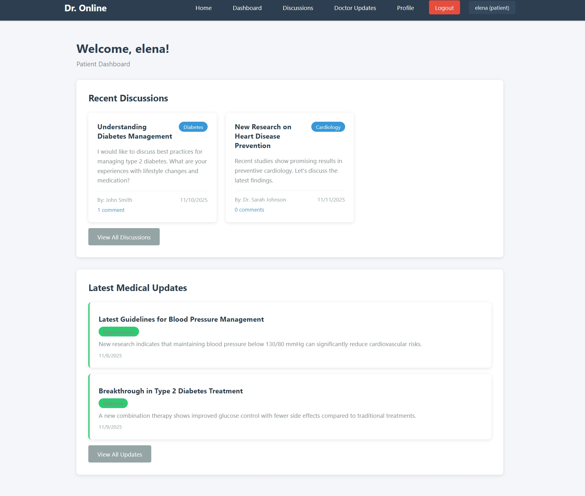
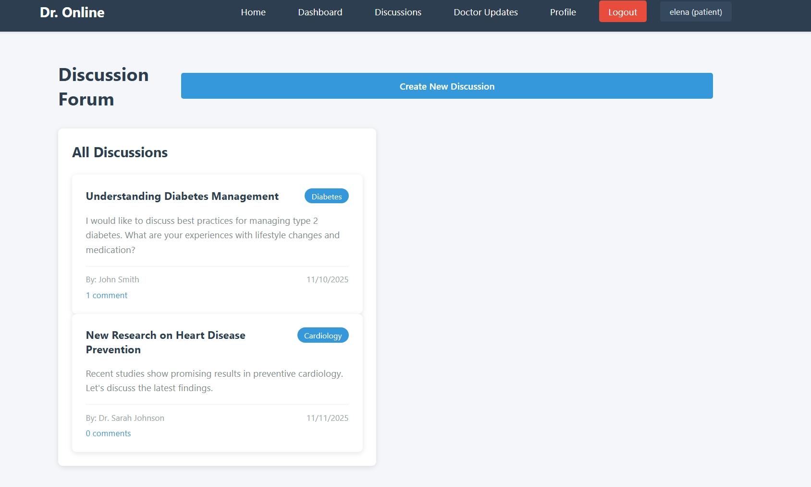
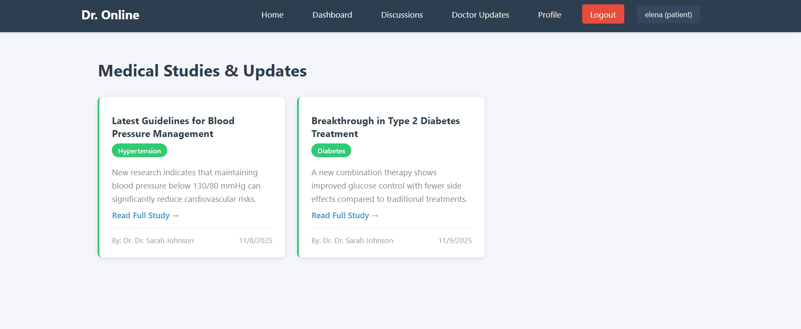
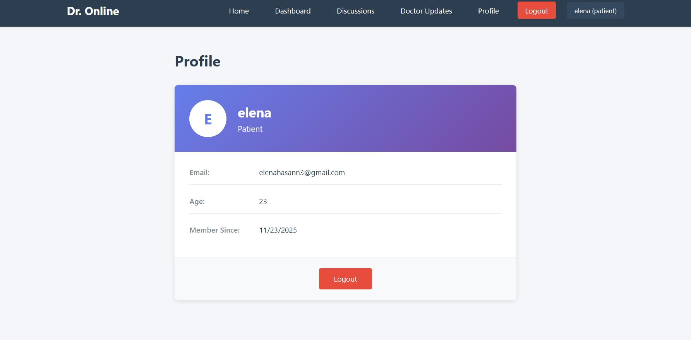

# Online Doctor Platform

## Project Description

Online Doctor is a comprehensive healthcare web application built with React that connects patients with medical professionals. The platform provides a modern, user-friendly interface for managing health consultations, accessing doctor updates, participating in health discussions, and tracking personal health information.

### Key Features

- **Dashboard**: Centralized view of your health information and appointments
- **Doctor Updates**: Stay informed with the latest medical news and updates from healthcare professionals
- **Discussions**: Community forum for health-related discussions and peer support
- **User Profile**: Manage your personal information and health records
- **Authentication**: Secure login and registration system for users
- **Responsive Design**: Optimized for desktop and mobile devices

### Technologies Used

- **React** (v19.2.0) - Frontend framework
- **React Router DOM** (v7.9.4) - Navigation and routing
- **React Scripts** (v5.0.1) - Build tooling and development server
- **CSS3** - Styling and responsive design

## Setup Instructions

### Prerequisites

Before you begin, ensure you have the following installed on your system:

- **Node.js** (version 14.0 or higher)
- **npm** (version 6.0 or higher) or **yarn** (version 1.22 or higher)

### Installation

1. **Clone the repository**

   ```bash
   git clone <repository-url>
   cd online-doctor
   ```

2. **Install dependencies**

   ```bash
   npm install
   ```

   or if you're using yarn:

   ```bash
   yarn install
   ```

3. **Start the development server**

   ```bash
   npm start
   ```

   or with yarn:

   ```bash
   yarn start
   ```

4. **Open your browser**

   The application will automatically open in your default browser at [http://localhost:3000](http://localhost:3000)

### Available Scripts

In the project directory, you can run:

#### `npm start`

Runs the app in development mode. The page will reload when you make changes. You may also see any lint errors in the console.

#### `npm test`

Launches the test runner in interactive watch mode.

#### `npm run build`

Builds the app for production to the `build` folder. It correctly bundles React in production mode and optimizes the build for the best performance.

#### `npm run eject`

**Note: this is a one-way operation. Once you `eject`, you can't go back!**

If you aren't satisfied with the build tool and configuration choices, you can `eject` at any time.

### Project Structure

```
online-doctor/
├── public/              # Static files
│   ├── index.html
│   ├── manifest.json
│   └── robots.txt
├── src/
│   ├── components/      # Reusable React components
│   │   ├── Login/       # Authentication components
│   │   ├── Navbar.js
│   │   ├── Footer.js
│   │   ├── PostCard.js
│   │   └── Comment.js
│   ├── pages/           # Page components
│   │   ├── Home.js
│   │   ├── Dashboard.js
│   │   ├── Discussions.js
│   │   ├── DoctorUpdates.js
│   │   └── Profile.js
│   ├── styles/          # CSS stylesheets
│   ├── assets/          # Images and other static assets
│   ├── App.js           # Main application component
│   ├── index.js         # Application entry point
│   └── data.js          # Data utilities
├── package.json         # Project dependencies and scripts
└── README.md           # Project documentation
```
## Screenshots

### Home Page



### dashboard Page



### discussion Page



### update Page



### profile Page

